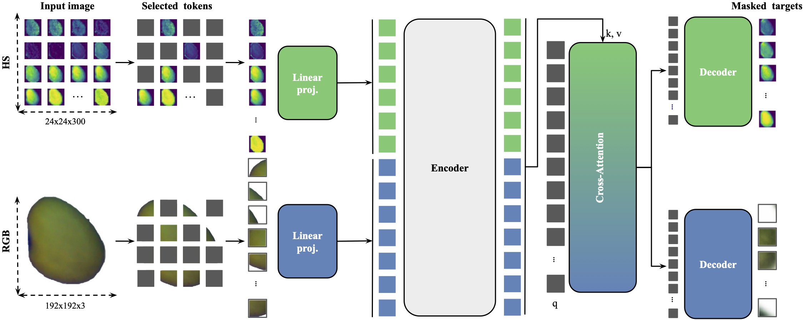
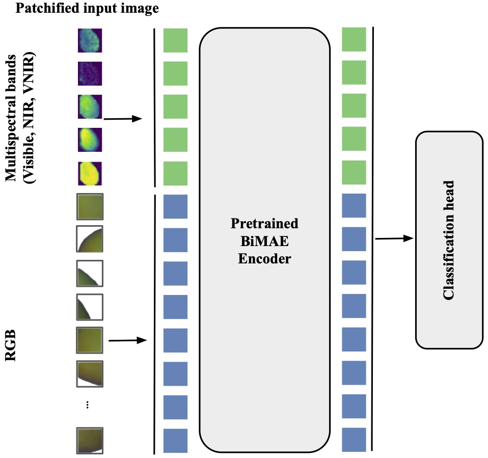

# BiMAE - A Bimodal Masked Autoencoder Architecture for Single-Label Hyperspectral Image Classification

## Input Data
The input data should be in the form of TFRecords. The TFRecords should contain the following features:
- 'id': tf.string,
- 'rgb_image': tf.float32,
- 'hs_image': tf.uint8,
- 'label': tf.string


## Pretraining


To train the model, run the following command:

```bash
nohup python mae_trainer.py --model=mae_vit_tiny_patch24 --scr_dir=path/to/tfrecord \
--batch_size=512 --epochs=300 --patch_size=24 --hs_image_size=24 --hs_num_patches=300 \
--hs_mask_proportion=0.9 --rgb_image_size=192 --rgb_num_patches=64 \
--hs_mask_proportion=0.75 > mae_trainer.log &  
```

## Finetuning




To finetune the model, run the following command:
```bash
nohup python mae_trainer_finetuning.py --model=mae_vit_tiny_patch24 --select_channels_strategy=step_60 \
--scr_dir=path/to/tfrecord --batch_size=512 --epochs=50 --patch_size=24 \
--hs_image_size=24 --hs_num_patches=300 --hs_mask_proportion=0.9 --rgb_image_size=192 \
--rgb_num_patches=64 --hs_mask_proportion=0.75 --num_classes=19 --from_scratch=False \
--target_modalities=bimodal > mae_trainer_finetuning.log &  
```

Following models are available:
- mae_vit_tiny_patch24
- mae_vit_small_patch24
- mae_vit_base_patch24

Following strategies for selecting channels are available:
- *step_60*  - select every 60th channel
- *step_30* - select every 30th channel
- *top_10* - select first 10 channels (1,10)
- *top_5* - select first 5 channels (1,5)
- *bottom_10* - select last 10 channels (290,300)
- *bottom_5* - select last 5 channels (295,300)

## License
This project is under the CC-BY-NC 4.0 license. See [LICENSE](https://github.com/max-kuk/bimae_seed_classification/blob/main/LICENSE.md)  for details.

## Citation
If you find this code useful in your research, please consider citing:
```
@inproceedings{kukushkin2024bimae,
  author={Kukushkin, Maksim and Bogdan, Martin and Schmid, Thomas},
  booktitle={2024 IEEE/CVF Conference on Computer Vision and Pattern Recognition Workshops (CVPRW)}, 
  title={BiMAE - A Bimodal Masked Autoencoder Architecture for Single-Label Hyperspectral Image Classification}, 
  year={2024},
  pages={2987-2996},
  keywords={Manifolds;Visualization;Costs;Scalability;Conferences;Self-supervised learning;Pattern recognition;masked autoencoder;hyperspectral imaging;seed purity testing;hyperspectral classification;multimodal masked autoencoder;masked modeling;self-supervised learning},
  doi={10.1109/CVPRW63382.2024.00304}}
```
